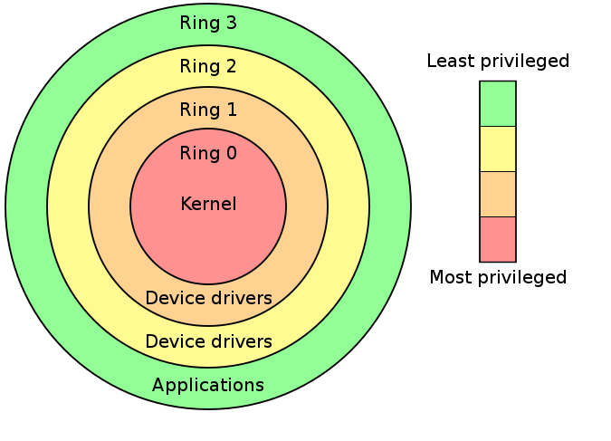

# Introduction to Linux kernel

In this section, we will present some fundamental knowledge needed for learning the Linux kernel pwn, which is somewhat like a course of "Tour on Operating System".

## Operating System Kernel

Operating system kernel is indeed a kind of software, which is somehow like a middle layer between general applications and hardware resource. The kernel is designed for scheduling system resources, controling IO devices, manipulating network and filesystems, and providing fast APIs for high-level applications.

Actually, operating system kernel is an abstract concept. It is essentially the same as the user process, which is code + data located in physical memory. The difference is that the code of kernel is usually running on a high-privilege environment of the CPU, which has full hardware access capabilities. When executing the code of user-mode program, the CPU usually runs in a low-privilege environment, which only has partial hardware access capabilities or missing that.

How CPU distinguish these different running privileges? Here comes another hardware concept: **hierarchical protection domains**.

## hierarchical protection domains

**Hierarchical protection domains** (aka Rings) is a model that restrict the access capabilities of hardware resources in different levels, which is enforced from hardware level.

Intel's CPUs have 4 different ring levels: ring0 (highiest privilege), ring1, ring2, ring3(lowest privilege). Generally we only use the ring0(for the kernel) and ring3(for the user-mode) in the design of modern operating systems.

Hence, we can give out two definitions:

- `User mode(userland)`: CPU running under ring3, with context of user-mode program
- `Kernel mode(kernelland)`: CPU running under ring0, with context of kernel-mode program

## Mode switch (system call)

While events like `system call`, `exception`, `interrupt` happens, the CPU will switch from user mode to kernel mode, and jump to corresponding handler functions.

We mainly focus on the system call, as it's the fundamental APIs for user mode programs to communicate with the kernel. The core process is like:

> Note that the CPU is running under the kernel mode after system call instructions were processing.

1. CPU swaps the value of `GS` register with another value saved in kernel by `swapgs` instruction, aiming to restore it after returning to the user land.
2. 

> TBD
